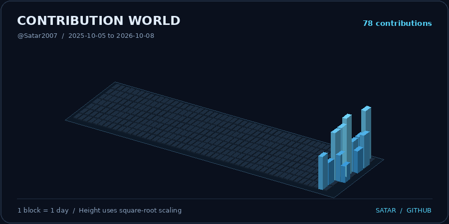

**Informatics Student · Universitas Sanata Dharma · Indonesia**

Belajar, membangun, dan berkembang lewat teknologi.

## About me

Halo! Saya **Bintang**, mahasiswa **S1 Informatika Universitas Sanata Dharma**, berasal dari **Manyaran, Wonogiri**.

Saya belajar membangun aplikasi yang bermanfaat untuk kegiatan sehari-hari. Di sini saya menyimpan proyek, mendokumentasikan proses belajar, dan berlatih berkolaborasi melalui Git dan GitHub.

- **Building:** JIMNY COFFEE, aplikasi point of sale berbasis Laravel.
- **Learning:** pengembangan web, database, sistem cerdas, dan pengolahan citra.
- **Exploring:** antarmuka interaktif dan visual 3D untuk web.
- **Beyond coding:** mendaki gunung dan bermain game.

## Technologies I use & learn

    
  

## Featured work

### JIMNY COFFEE — Point of Sale

Aplikasi kasir berbasis web yang saya kembangkan bersama tim untuk membantu operasional kedai kopi, mulai dari pesanan pelanggan sampai laporan penjualan.

`Laravel` · `PHP` · `MySQL` · `Tailwind CSS` · `Alpine.js`

| Area | Pengembangan |
| :--- | :--- |
| Kasir & transaksi | Pesanan pelanggan, transaksi tunai, serta integrasi pembayaran Midtrans Sandbox |
| Menu & stok | Ketersediaan menu, reservasi stok, dan pencatatan perubahan stok |
| Hak akses | Pembagian peran owner, admin, dan kasir |
| Operasional | Shift, kehadiran, dashboard, dan laporan penjualan |
| Smart Assistant | Ringkasan serta pengingat sesuai peran pengguna |

**[Explore JIMNY COFFEE →](https://github.com/Satar2007/Proyek-Informatika)**

### Cinematic 3D Portfolio

Eksplorasi portofolio web dengan animasi, elemen 3D, dan interaksi visual untuk menampilkan profil serta proyek.

**[Explore the portfolio repository →](https://github.com/Satar2007/cinematic-3d-portfolio-template)**

## GitHub metrics

  

Bahasa yang tampil mencerminkan komposisi kode repository yang dianalisis, bukan ukuran tingkat keahlian.

## Contribution world

Kontribusi sehari-hari, dilihat dari sudut yang berbeda.

  

<b>Explore the isometric calendar</b>

 

  

## Contribution arcade

<picture>
  <source media="(prefers-color-scheme: dark)" srcset="assets/generated/pacman-contribution-graph-dark.svg" />
  <source media="(prefers-color-scheme: light)" srcset="assets/generated/pacman-contribution-graph.svg" />
  
</picture>

## Learning journey

| Focus | What I am learning |
| :--- | :--- |
| Web development | Membangun alur aplikasi dengan PHP dan Laravel |
| Database | Merancang relasi dan menjaga konsistensi data dengan MySQL |
| Intelligent systems | Mengeksplorasi NLP, CNN, dan penerapannya melalui praktikum |
| Collaboration | Branch, commit, pull request, serta pengujian perubahan |
| Documentation | Menulis README dan dokumentasi proyek yang mudah dipahami |

---

**Small steps. Useful things.**

*Belajar sedikit demi sedikit, lalu membangun sesuatu yang berguna.*

[Explore my repositories](https://github.com/Satar2007?tab=repositories)

Metrics by <a href="https://github.com/lowlighter/metrics">lowlighter</a> · Pac-Man by <a href="https://github.com/abozanona/pacman-contribution-graph">abozanona</a> · Skyline rendered from GitHub contribution data

